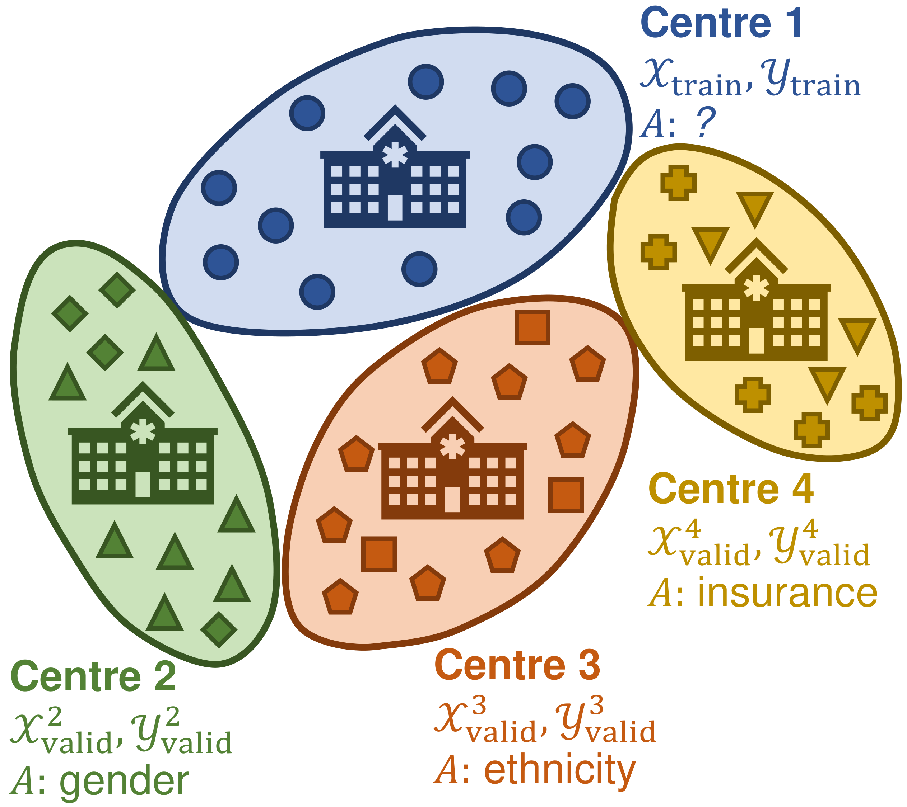
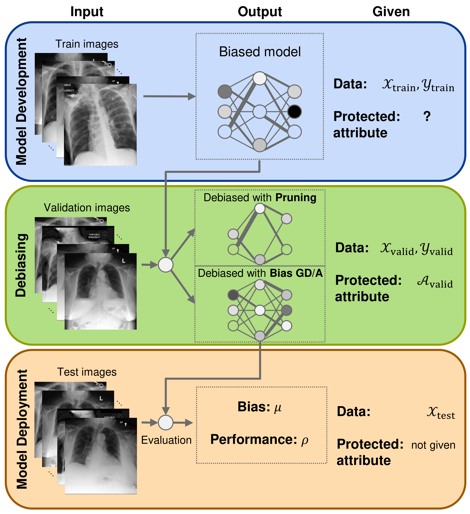

# Debiasing Deep Chest X-Ray Classifiers using Intra- and Post-processing Methods

This repository holds the official code for the paper "*Debiasing Deep Chest X-Ray Classifiers using Intra- and Post-processing Methods*" presented at the [ICLR 2022 Workshop on Socially Responsible Machine Learning](https://iclrsrml.github.io/) and accepted at the [the 7<sup>th</sup> Machine Learning for Healtcare Conference (MLHC), 2022](https://www.mlforhc.org/). A short explanation of the method is provided in this [contributed talk](https://youtu.be/Kw3Cf7XxzNs); poster can be viewed [here](documents/Debiasing_Intra-_and_Post-processing_MLHC_2022_poster.pdf).

<p align="center">
  
</p>
<center>
  <i>The <b>intra-processing setting</b>: a classification model is trained on centre <b>1</b>, and debiased on centres <b>2</b>, <b>3</b>, and <b>4</b> that might have different protected attributes and fairness constraints, denoted by $A$.</i>
</center>

### 🦴 Motivation



Deep neural networks for image-based screening and computer-aided diagnosis have achieved expert-level performance on various medical imaging modalities, including chest radiographs. Recently, several works have indicated that these state-of-the-art classifiers can be biased with respect to sensitive patient attributes, such as race or gender, leading to growing concerns about demographic disparities and discrimination resulting from algorithmic and model-based decision-making in healthcare. A practical scenario of mitigating bias w.r.t. protected attributes could be as follows: consider deploying a predictive neural-network-based model in several clinical centres with different demographics (see the figure above). The constraints on the bias and protected attribute of interest might vary across clinical centres due to different population demographics. Therefore, it might be more practical to debias the original model based on the *local* data, following an **intra-** or **post-processing** approach.

### ✂️ Pruning and Gradient Descent/Ascent for Debiasing

This repository implements two novel intra-processing techniques based on **fine-tuning** and **pruning** an already-trained neural network. These methods are simple yet effective and can be readily applied *post hoc* in a setting where the protected attribute $A$ is unknown during the model development and test time. The general debiasing procedure is schematically summarised in the figure to the right: an already-trained network $f$<sub></sub>$(\cdot)$ is debiased on held-out validation data <sub>valid</sub>, <sub>valid</sub>, using differentiable proxy functions for the classification parity, and can produce unbiased predictions without the protected attribute $A$ at *test time*.
  
### 📝 Requirements
All the libraries required are in the conda environment [`environment.yml`](environment.yml). To install it, follow the instructions below:
```
conda env create -f environment.yml   # install dependencies
conda activate DiffBiasProxies        # activate environment
```
To run the [**MIMIC-III**](https://physionet.org/content/mimiciii/1.4/) experiments, you will need to first execute the [code](https://github.com/USC-Melady/Benchmarking_DL_MIMICIII) by [Purushotham et al. (2018)](https://www.sciencedirect.com/science/article/pii/S1532046418300716) to get the pre-processed data. To prepare [**MIMIC-CXR**](https://physionet.org/content/mimic-cxr/2.0.0/) data, run [this Jupyter notebook](notebooks/CXR_Mimic_Preprocessing.ipynb).

### ⚙️ Usage
Scripts [`main_tabular.py`](main_tabular.py) and [`main_ChestXRay.py`](main_ChestXRay.py) run the experiments on the tabular and chest X-ray data, respectively. [`/bin`](bin/) folder contains example shell scripts for concrete datasets:
- **Tabular benchmarks**: [`run_adult`](bin/run_adult), [`run_bank`](bin/run_bank), [`run_compas`](bin/run_compas), [`run_mimic_iii`](bin/run_mimic_iii)
- **MIMIC-CXR**: [`run_mimic_cxr`](bin/run_mimic_cxr)

For example, to run debiasing on the Bank dataset, from the [`/bin`](bin/) folder, execute the command
```
python ../main_tabular.py --config ../configs/bank.yml
```
Above, file [`bank.yml`](configs/bank.yml) specifies a configuration for the experiment.

#### YAML Parameters

For the experiments on **tabular** data, the configuration should contain the following parameters:
```
seed: [777, 666]                      # list of seeds for replications
experiment_name: my_experiment        # name of the experiment, for logging purposes
dataset: bank                         # name of the dataset 
                                        # {adult, bank, compas, mimic, 
                                          # synthetic_loh, synthetic_zafar}
protected: age                        # name of the protected attribute
metric: eod                           # bias measure {spd, eod}
accc_metric: balanced_accuracy        # performance measure 
                                        # {balanced_accuracy, accuracy, f1_score}
modelpath: my_model                   # name of the trained model, for logging purposes
dataset_alpha: 2.0                    # α parameter for the synthetic dataset by Loh et al.
dataset_theta: 0.7                    # θ parameter for the sythetic datatset by Zafar et al.

models:                               # list of models/debiasing procedures to be run
  - default
  - pruning
  - biasGrad

pruning:                              # pruning parameters
  dynamic: true                       # re-compute neuron influences after every pruning step?
                                        # {true, false}
  step_size: 1                        # number of units pruned per step
  stop_early: true                    # stop when the performance is close to random or
                                        # the maximum number of steps is reached? 
                                          # {true, false}
  val_only: true                      # perform pruning only on the validation set? 
                                        # {true, false}
  obj_lb: 0.80                        # ϱ parameter, a lower bound on the performance 

biasGrad:                             # bias gradient descent/ascent parameters
  lr: 0.00001                         # learning rate
  n_epochs: 200                       # number of epochs
  batch_size: 256                     # batch size
  val_only: true                      # perform fine-tuning only on the validation set?
                                        # {true, false}
  obj_lb: 0.70                        # ϱ parameter, a lower bound on the performance
  n_evals: 3                          # number of times to evaluate the model per epoch
```
For the **chest X-ray** experiments, additional parameters include:
```
priv_class: M                         # name of the privileged class of the prot. attribute
unpriv_class: F                       # name of the unprivileged class of the prot. attribute
prot_ratio: 0.75                      # the ratio between privileged and unprivileged 
                                        # class frequencies in the training set
disease: Enlarged Cardiomediastinum   # disease label to be predicted
num_workers: 2                        # number of loader worker processes for data loaders

default:                              # original model's parameters
  batch_size: 32                      # batch size
  n_epochs: 20                        # number of training epochs
  arch: vgg                           # network's architecture {vgg, resnet}
  pretrained: true                    # initialise the model with pretrained weights? 
                                        # {true, false}

pruning:                              # pruning parameters
  max_steps: 10                       # the maximum number of steps before early stopping
  batch_size: 80                      # batch size for approximating neuron influence
```
For the further details regarding YAML parameters, consult the [code](https://github.com/abacusai/intraprocessing_debiasing) by [Savani et al. (2020)](https://arxiv.org/abs/2006.08564).

#### Code Structure

Folder [`/algorithms`](algorithms/) contains implementation of the debiasing procedures. [`pruning.py`](algorithms/pruning.py) and [`biasGrad.py`](algorithms/biasGrad.py) hold the code for the pruning and bias gradient descent/ascent. The file structure of the project is as follows:
```
├── algorithms                  # debiasing algorithms
├── bin                         # shell scripts and logs
│   ├── models                  # trained models are saved here
│   ├── results
│   │   ├── figures             # plotting output of the experiments 
│   │   └── logs                # experiment logs
├── configs                     # .yml files
├── datasets                    # data loaders and structures
│   ├── chestxray_dataset.py
│   ├── mimic_iii_dataset.py
│   ├── simulations.py
│   └── tabular.py
├── main_ChestXRay.py           # script for the chest X-ray experiments
├── main_tabular.py             # script for the experiments on tabular data
├── models                      # base classifiers
│   ├── networks_ChestXRay.py
│   └── networks_tabular.py
├── notebooks                   # Jupyter notebooks
└── utils                       # utility functions
    ├── data_utils.py
    ├── evaluation.py
    ├── misc_utils.py
    ├── plotting.py
    └── sim_utils.py
```

Further details are documented within the code.

### 🙏 Acknowledgements
- The code structure is based on the [repository](https://github.com/abacusai/intraprocessing_debiasing) by [Savani et al. (2020)](https://arxiv.org/abs/2006.08564)
- For MIMIC-III, we used the pre-processing based on the [code](https://github.com/USC-Melady/Benchmarking_DL_MIMICIII) by [Purushotham et al. (2018)](https://www.sciencedirect.com/science/article/pii/S1532046418300716)
- For MIMIC-CXR, we adpated [implementation](https://github.com/choprashweta/Adversarial-Debiasing) of adversarial in-processing by Shweta Chopra et al.
- One of the synthetic datasets is based on the [code](https://github.com/mbilalzafar/fair-classification) by [Zafar et al. (2017)](http://proceedings.mlr.press/v54/zafar17a.html)

### 📧 Maintainers
- [Ričards Marcinkevičs](https://rmarcinkevics.github.io/) ([ricards.marcinkevics@inf.ethz.ch](mailto:ricards.marcinkevics@inf.ethz.ch))
- [Ece Ozkan](https://mds.inf.ethz.ch/team/detail/ece-oezkan-elsen) ([ece.oezkanelsen@inf.ethz.ch](mailto:ece.oezkanelsen@inf.ethz.ch))

### 📕 References
To better understand the background behind this work, we recommend reading the following papers:
- Muhammad Bilal Zafar, Isabel Valera, Manuel Gomez Rogriguez, and Krishna P. Gummadi. Fairness Constraints: Mechanisms for Fair Classification. In *Proceedings of the 20th International Conference on Artificial Intelligence and Statistics*, volume 54, pages 962–970. PMLR, 2017.
- Brian Hu Zhang, Blake Lemoine, and Margaret Mitchell. Mitigating unwanted biases with adversarial learning. In *Proceedings of the 2018 AAAI/ACM Conference on AI, Ethics, and Society*. ACM, 2018.
- Klas Leino, Shayak Sen, Anupam Datta, Matt Fredrikson, and Linyi Li. Influence-directed explanations for deep convolutional networks. In *IEEE International Test Conference (ITC)*. IEEE, 2018.
- Yash Savani, Colin White, and Naveen Sundar Govindarajulu. Intra-processing methods for debiasing neural networks. In *Advances in Neural Information Processing Systems*, volume 33, pages 2798–2810. Curran Associates, Inc., 2020.
- Laleh Seyyed-Kalantari, Haoran Zhang, Matthew B. A. McDermott, Irene Y. Chen, and Marzyeh Ghassemi. Underdiagnosis bias of artificial intelligence algorithms applied to chest radiographs in under-served patient populations. *Nature Medicine*, 27(12):2176–2182, 2021.
- Chuizheng Meng, Loc Trinh, Nan Xu, James Enouen, and Yan Liu. Interpretability and fairness evaluation of deep learning models on MIMIC-IV dataset. *Scientific Reports*, 12(1), 2022.

### 🏆 Citation

Please cite our paper and repository as
```
@misc{Marcinkevics2022,
  author = {Marcinkevi\v{c}s, Ri\v{c}ards and Ozkan, Ece and Vogt, Julia E.},
  title = {Debiasing Neural Networks using Differentiable Classification Parity Proxies},
  year = {2022},
  note = {ICLR 2022 Workshop on Socially Responsible Machine Learning (SRML)}
}
```
